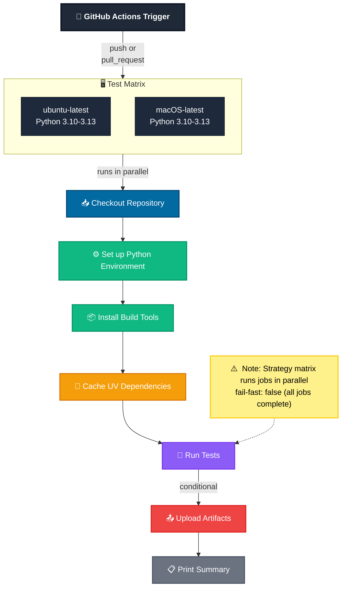

# CI Flow (GitHub Actions)

This document shows the CI flow used in `.github/workflows/test.yml`.

## Workflow Summary

The CI pipeline triggers on every push and pull request, running tests across multiple OS and Python version combinations. Key features:

- **Parallel Testing**: Matrix strategy tests on Ubuntu and macOS with Python 3.10-3.13
- **Dependency Caching**: UV dependencies are cached for faster runs
- **Test Execution**: Comprehensive test suite via pytest
- **Artifact Upload**: Test results and logs uploaded conditionally
- **No Early Exit**: `fail-fast: false` ensures all matrix jobs complete

## Key Stages

| Stage | Purpose |
|-------|---------|
| 🚀 Trigger | Initiates workflow on code changes |
| 📥 Checkout | Retrieves repository code |
| ⚙️ Setup | Configures Python environment |
| 💾 Cache | Optimizes dependency installation |
| 🧪 Tests | Executes test suite |
| 📤 Artifacts | Captures test results |
| 📋 Summary | Reports final status |
